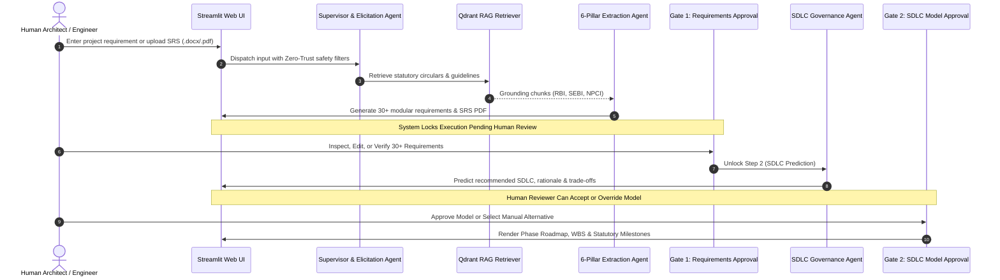

# System Architecture & Multi-Agent Swarm Specification

> **Agentic RE-SDLC Advisor**: Autonomous Multi-Agent Requirements Engineering & Adaptive SDLC Recommendation System for Indian Regulated Financial Institutions.

---

## 1. High-Level System Architecture

The Agentic RE-SDLC platform is designed around a **Zero-Trust, Human-in-the-Loop (HITL), Multi-Agent Architecture** tailored specifically for sovereign Indian financial entities governed by **RBI, NPCI, UIDAI, SEBI, and DPDP Act 2023**.

```
                ┌─────────────────────────────────────────────────────────┐
                │               Streamlit Interactive UI                  │
                │        (Session State, Chat, Verification Gates)        │
                └───────────────────────────┬─────────────────────────────┘
                                            │ HTTP / In-Process
                ┌───────────────────────────▼─────────────────────────────┐
                │          FastAPI Orchestrator / Dispatcher              │
                │         (Guardrails, Telemetry, PostgreSQL DB)          │
                └───────────────────────────┬─────────────────────────────┘
                                            │
   ┌────────────────────────────────────────┴────────────────────────────────────────┐
   │                        Autonomous Multi-Agent Swarm                             │
   │                                                                                 │
   │  ┌──────────────────────────┐                   ┌────────────────────────────┐  │
   │  │   1. Supervisor Agent    │                   │   2. Elicitation Agent     │  │
   │  │  (Zero-Trust Gatekeeper) │──────────────────▶│ (Domain & Intent Profiler) │  │
   │  └──────────────────────────┘                   └─────────────┬──────────────┘  │
   │                                                               │                 │
   │  ┌──────────────────────────┐                   ┌─────────────▼──────────────┐  │
   │  │  4. Architecture Agent   │                   │  3. Compliance RAG Agent   │  │
   │  │  (6-Pillar Extraction)   │◀──────────────────│  (Qdrant Semantic Search)  │  │
   │  └────────────┬─────────────┘                   └────────────────────────────┘  │
   │               │                                                                 │
   │  ┌────────────▼─────────────┐                   ┌────────────────────────────┐  │
   │  │  5. Artefact Generator   │                   │   6. SDLC Governance Agent │  │
   │  │   (SRS Engine & PDF)     │──────────────────▶│  (Fine-Tuned 4-bit LoRA)   │  │
   │  └──────────────────────────┘                   └────────────────────────────┘  │
   └─────────────────────────────────────────────────────────────────────────────────┘
                                   │
                ┌──────────────────┴──────────────────┐
                ▼                                     ▼
   ┌─────────────────────────┐           ┌─────────────────────────┐
   │ Qdrant Vector Database  │           │  PostgreSQL Persistence │
   │ (3,119 Statutory Chunks)│           │ (Sessions, Audit Trails)│
   └─────────────────────────┘           └─────────────────────────┘
```

---

## 2. Core Architectural Pillars

Every financial specification generated by the platform adheres to a mandatory **6-Pillar Engineering Standard (Minimum 30 Requirements)**:

```
                      ┌──────────────────────────────────────┐
                      │   6-Pillar Architectural Standard    │
                      └──────────────────┬───────────────────┘
         ┌──────────────┬────────────────┼────────────────┬──────────────┐
         ▼              ▼                ▼                ▼              ▼
   ┌───────────┐  ┌───────────┐    ┌───────────┐    ┌───────────┐  ┌───────────┐
   │1. Frontend│  │2. Backend │    │3. Auth &  │    │4. Security│  │5. Database│
   │   UI/UX   │  │   APIs    │    │    KYC    │    │ Compliance│  │ Residency │
   └───────────┘  └───────────┘    └───────────┘    └───────────┘  └───────────┘
                                         │
                                   ┌─────▼─────┐
                                   │6. Resil-  │
                                   │  ience &  │
                                   │  Disaster │
                                   └───────────┘
```

### Pillar Definitions & Statutory Mapping

| Pillar | Statutory Focus | Regulations Enforced | Minimum Requirements |
|---|---|---|:---:|
| **1. Frontend UI/UX** | Client security, accessibility, localized vernacular UI | RBI Digital Payment Security Sec 4, DPDP Act 2023 Multilingual Consent | 5 |
| **2. Backend Architecture** | Microservices, idempotent switch processing, Kafka telemetry | RBI Core Banking Architecture, PMLA 2002 Sec 12 | 7 |
| **3. Auth & KYC Governance** | Liveness, biometric binding, Aadhaar Data Vault (ADV) | RBI KYC Master Direction, UIDAI ADV Circular 2017 | 5 |
| **4. Security & Compliance** | Hardware Security Modules (HSM), TLS 1.3, WORM audit trails | NPCI Mobile App Security v2.4, CERT-In Direction 2022 | 6 |
| **5. Database Residency** | 100% on-soil data localization, ACID double-entry ledgers | RBI Storage of Payment System Data (2018), DPDP 2023 | 5 |
| **6. Resilience & DR** | Active-Standby multi-zone clustering, RPO/RTO, refund dispatch | RBI TAT Harmonisation (2019), SEBI CSCRF BCP/DR | 5 |

---

## 3. Human-in-the-Loop (HITL) Stage-Gate Workflow

Financial regulations mandate that automated systems cannot self-certify production execution. The architecture enforces two distinct stage gates:



---

## 4. Hardware & Resource Budgeting (Edge-Optimized)

The entire multi-agent swarm is designed to execute locally on consumer/laptop GPUs (such as an NVIDIA RTX 3050 Laptop GPU with 6.0 GB VRAM):

- **Base Model**: `unsloth/Qwen2.5-3B-Instruct-bnb-4bit` (~2.05 GB VRAM).
- **LoRA Adapters**: Fine-tuned PEFT rank-16 adapters attached and dynamically swapped in shared memory (~30 MB).
- **Vector Search**: Qdrant vector database running in-memory or on-disk with fast HNSW cosine indexes (~150 MB RAM).
- **Relational DB**: Dockerized PostgreSQL 16 on port 5433 for multi-session persistence.
